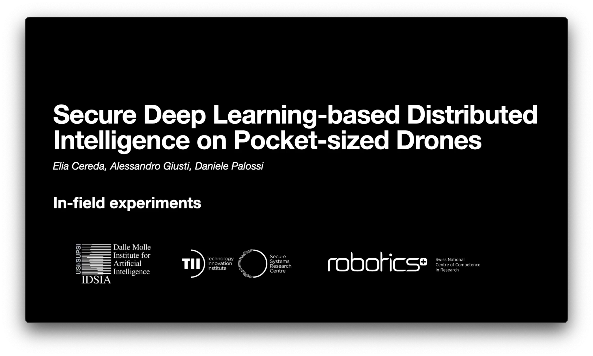

## EWSN'23 7876 — Supplementary material

Secure Deep Learning-based Distributed Intelligence on Pocket-sized Drones

### Authors
Elia Cereda1,
Alessandro Giusti1,
Daniele Palossi1,2

1 Dalle Molle Institute for Artificial Intelligence (IDSIA), USI and SUPSI, Lugano, Switzerland. 
2 Integrated Systems Laboratory (IIS), ETH Zürich, Zürich, Switzerland. 

### In-field experiments and system demonstration
* <a href="https://youtu.be/QwTiigAs4cA">Control performance: 8-branch MobileNetV2</a>
* <a href="https://youtu.be/QwTiigAs4cA?t=66">Control performance: PULP-Frontnet - SoA baseline</a>
* <a href="https://youtu.be/QwTiigAs4cA?t=135">On-board security demonstration</a>

